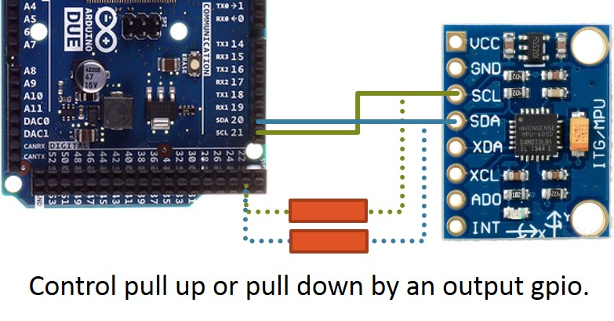

# MPU6050_read
Arduino: Hardware &amp; software solution for annoying "MPU6050 connection failed" problem.

## Problem statement
The MPU6050 has no external reset port, so if you reset the arduino, the MPU6050 however does not reset as well.  
Hence when we in initialize or restart the MPU6050 in our program flow, the I2C bus usually gets stuck and it displays "MPU6050 connection failed" 

## Wiring
  
Connect pull resistors in parallel with our SDA and SCL lines.  
Pull down first (everything to 0V) and then pull up -- Control this using an output gpio (it's D23 in provided source code).  
Hence we achieve the "reset" goal and the I2C bus doesn't get stuck again if you restart the Arduino.  
